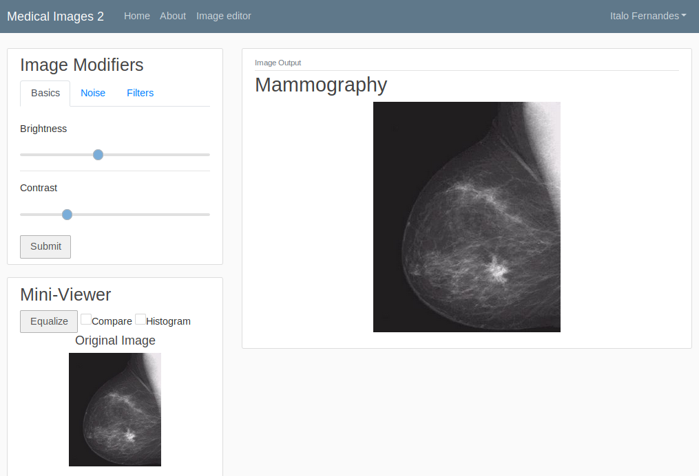

# Imagens Médicas 2 (Medical Images 2)
>Open-source initiative for a system for medical image processing.

## Online Version (Under Development)
Follow the link: [IM2 WebApp](http://italogsfernandes.com/imagens-medicas-2)

## Summary

The project [IM2_app](https://github.com/italogsfernandes/imagens-medicas-2) is an initiative to create an open source medical imaging system.

**Obs**:
> The first IM2_app app was developed in MATLAB, this generates contradictions regarding the open-source initiative, however the program must run with all its functionality in Octave.

> There is also a version developed in python, whose app has almost all the features of the MATLAB version, and a few more (eg count the number of colonies).

> A Third version, as a web application is under development and will be released no later than September.

## Instalations
* **MATLAB version**: IM2_app is in its version 1.1.0. Run __*Apps/mIM2_app*__ to use the interface app or __*toolbox/matlab*__ to see its image processing functions.
* **Python version**: Run `python im2_app.py`, located in the folder __*Apps/pyIM2_app*__.
* **Web version**: Visit our web page after the release of this version.

## Contribute
If you want to contribute to the project, all help is welcome. Contributing is also a way to learn more about [*social coding*](http://opentechschool.github.io/social-coding/), bug reports, development tips, *pull requests*...

## In this repository
- docs: Images, guides, references, consulted codes.
- **Apps**: App Interface Codes.
    - **Apps/mIM2_app**: GUI developed with MATLAB .
    - **Apps/pyIM2_app**: GUI developed with Python (PyQT).
- Aulas: Classes and practical work of the discipline. Codes in python and matlab.
- datasets: Images used in classes and some sample images for app testing.
- **toolbox**:
    - **matlab**: IM2_app image processing matlab functions and tools.
    - **python**: IM2_app image processing python functions. (scipy, scikit-image e open-cv)
- **im2webapp**: Web Application source code.

## Configuring the development environment
### Desktop Version
* [Python3](https://www.python.org/downloads/) with the following modules installed:
`pip install -r requirements.txt`
* [Matlab](https://www.mathworks.com/pricing-licensing.html?prodcode=ML&intendeduse=student) or [Octave](https://www.gnu.org/software/octave/) (Open-Source Alternative).
### WebApp
* [Python3](https://www.python.org/downloads/) with the following modules installed:
`pip install -r requirements.txt`
* See file: [aws_educate.md](aws_educate/aws_educate.md)

## More Info
* [An image-processing based automated bacteria colony counter](http://ieeexplore.ieee.org/document/5291926/).
* [Nondestructive technique for bacterial count based on image processing](http://www.oatext.com/Nondestructive-technique-for-bacterial-count-based-on-image-processing.php).
* [Image manipulation and processing using Numpy and Scipy](http://www.scipy-lectures.org/advanced/image_processing/index.html).
* [MIT Course: Biomedical Signal and Image Processing](https://ocw.mit.edu/courses/health-sciences-and-technology/hst-582j-biomedical-signal-and-image-processing-spring-2007/index.htm)

## License
This project is licensed under the MIT License - see the [LICENSE.md](LICENSE.md) file for details.

## Autores
* **Ronaldo Sena** - https://github.com/ronaldosena - ronaldo.sena@outlook.com
* **Italo Fernandes** - https://github.com/italogfernandes - italogsfernandes@gmail.com

See also the list of [contributors](https://github.com/italogsfernandes/imagens-medicas-2/contributors) who participated in this project.
